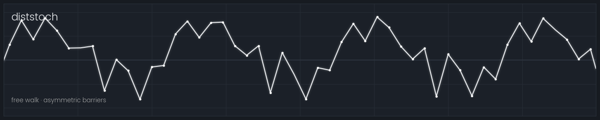

# Tether

Experimental SuperCollider UGens for digital synthesis.

## UGens

- **Gendreve** — mean-reverting breakpoint walk.
- **Diststoch** — free breakpoint walk; evolving distributions, asymmetric barriers, jump controls.
- **Cyclegen** — a frequency sequence sets the pitch one cycle at a time; the waveform walks.
- **Chaosgen** — breakpoint values driven by a logistic map.
- **Varperiod** — live control-point count; sweeps timbral density.
- **Fracflight** — mean-reverting walk with fractional (Hurst) and Lévy motion.
- **Grainstoch** — an emission pitch carrying walking grains.
- **Probstoch** — sparse grains on a fixed-pitch waveform.

## Build

Needs a SuperCollider source tree whose plugin `api_version` matches your scsynth.

```sh
./build.sh /path/to/supercollider
```

Then recompile the class library and reboot the server. Tagging `vX.Y.Z` builds
multi-platform binaries via GitHub Actions.
