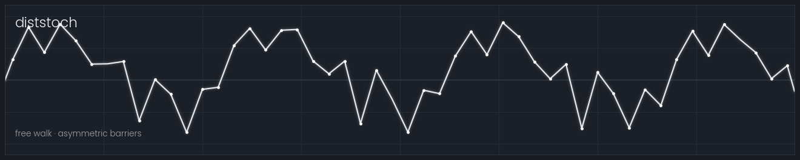

# Tether

Experimental SuperCollider UGens for digital synthesis. Work-in-progress.

## UGens

- **Limcycle** : relaxation with stochastic forcing.

- **Gendreve** : mean-reverting chaotic breakpoint walk, tethered to a template.
- **Diststoch** : free chaotic breakpoint walk with asymmetric barriers.
- **Cyclegen** : a frequency sequence sets pitch per cycle.
- **Chaosgen** : breakpoint values driven by a logistic map.
- **Varperiod** : live control-point count for timbral density.
- **Fracflight** : mean-reverting walk with fractional motion.
- **Grainstoch** : an emission pitch carrying walking grains.
- **Probstoch** : sparse grains on a fixed-pitch waveform.

- **Oscnet** : coupled-oscillator network with selectable topology and nonlinear feedback.
- **Ecostoch** : predator-prey population synthesis.
- **Scangen** : scanned synthesis on a dynamic mass-spring lattice.
- **Lifestoch** : ALife birth-death breakpoint population.

## Build

Needs a SuperCollider source tree whose plugin `api_version` matches your scsynth.

```sh
./build.sh /path/to/supercollider
```

Then recompile the class library and reboot the server. Tagging `vX.Y.Z` builds
multi-platform binaries via GitHub Actions.
